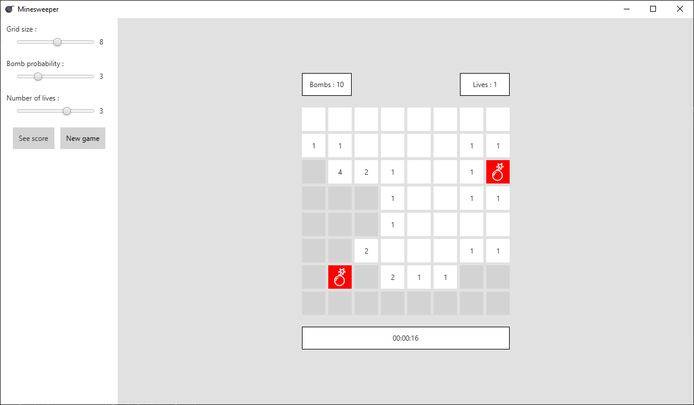
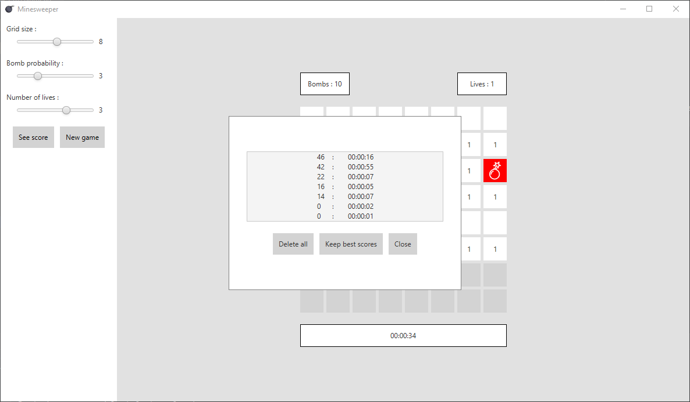

# Minesweeper

Implementation of the famous game [Minesweeper](https://en.wikipedia.org/wiki/Minesweeper_(video_game)).

## Description

This project has been created with Java and JavaFX and represents a simple Minesweeper.

You can play the game and change different parameters:
- The size of the grid.
- The probability of having bombs on the grid.
- The number of lives before losing the game.



You can also view each score and manage previous ones:
- Clear all scores.
- Keep only the ten best scores.



## Getting Started

### Dependencies

- Java 12.0.1
- JavaFX 15.0.1
- Gradle 6.7.1

### Executing program

To run this program, simply execute the following command:

```Groovy
gradle run
```

## Authors

- [Yorick Estievenart](https://github.com/yoest)

## License

This project is licensed under the MIT License - see the LICENSE.txt file for details
